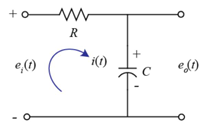
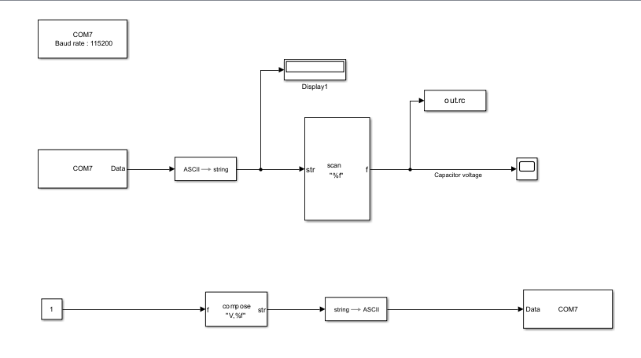
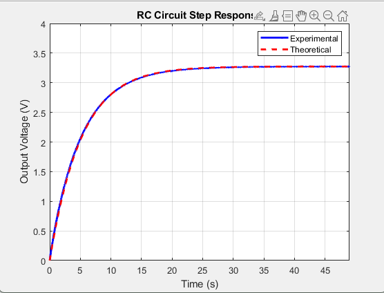
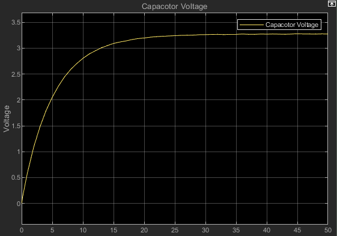
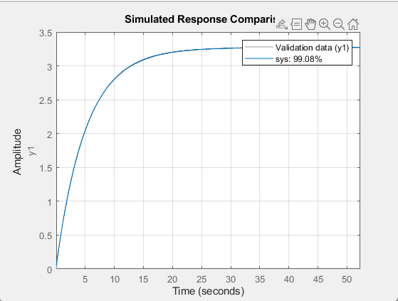

# Experimental RC Circuit System Identification  
**Hardware-in-the-Loop using STM32F411CEU6 + DMA + USB-CDC + MATLAB/Simulink**

**Course:** KWASU AAE 306 – Control Systems Engineering  
**Author:** Osokoya Oluwabukunmi Oladapo (23/67AA/544)  
**Date:** May 2026

---

## 1. Project Overview

This project demonstrates a complete **Hardware-in-the-Loop (HITL)** system identification workflow for a classical first-order RC plant.  

Real-time experimental data is acquired on an STM32F411CEU6 microcontroller using DMA and streamed via USB-CDC to MATLAB/Simulink. A black-box transfer function is then estimated and rigorously validated against the analytical first-principles model.

The work sits at the intersection of **flight controls**, **embedded systems**, and **data-driven modelling** — core skills in modern aerospace engineering.

> Physical plant → Embedded data acquisition → Real-time streaming → System identification → Model validation

---

## 2. Physical Plant

- Resistor: 10 kΩ (metal-film, ±5 %)
- Capacitor: 470 µF electrolytic
- Theoretical time constant:  
- Theoretical time constant: $\tau = RC = 4.7\,\text{s}$

Circuit schematic:



---

## 3. Hardware Architecture

**Microcontroller:** STM32F411CEU6 “Black Pill” (ARM Cortex-M4)

| Function                  | Pin  | Peripheral              |
|---------------------------|------|-------------------------|
| Step input (0 → 3.3 V)    | PA7  | GPIO Output             |
| Capacitor voltage sensing | PA2  | ADC1 Channel 2          |
| Data streaming            | USB  | USB OTG FS (CDC)        |

Pinout highlighting the critical pins:



---

## 4. Firmware Implementation

### Key Design Decisions
- **DMA circular mode** → zero CPU overhead during sampling
- **USB-CDC** instead of classic UART → higher reliability and speed
- Forced initial discharge of the capacitor → known initial condition
- Simple command protocol (`V,0` / `V,1`) for clean step control from the host

### Critical Code Snippets

**Initialisation (force known state)**
```c
HAL_GPIO_WritePin(GPIOA, GPIO_PIN_7, GPIO_PIN_RESET);  // Discharge
HAL_Delay(5000);
HAL_ADC_Start_DMA(&hadc1, (uint32_t*)&adc_dma_result, 1);
```

**Main acquisition loop (100 Hz)**
```c
while (1) {
    printf("%hu,%.3f\n", adc_dma_result,
           (float)adc_dma_result * (3.3f / 4095.0f));
    HAL_Delay(10);
}
```

---

## 5. Host-Side Workflow (MATLAB / Simulink)

1. **Data Acquisition** – Simulink model with Serial Receive block and automatic time alignment at the step instant.
2. **System Identification**
   ```matlab
   io  = iddata(y', u', Ts);
   sys = tfest(io, 1, 0);          % 1 pole, 0 zeros
   compare(io, sys);
   ```
3. **Validation** against first-principles response.

Experimental vs Theoretical response:



Live Simulink scope of the charging curve:



---

## 6. Quantitative Results

| Metric                        | Value                  |
|-------------------------------|------------------------|
| Model Fitness                 | **99.08 %**            |
| Final Prediction Error (FPE)  | 3.509 × 10⁻⁵           |
| Mean Squared Error (MSE)      | 3.504 × 10⁻⁵           |
| Theoretical τ                 | 4.7 s                  |
| Experimental τ                | ≈ 5.16 s               |

### Identified Transfer Function

The System Identification Toolbox returned the following continuous-time transfer function:

$$
G(s) = \frac{Y(s)}{X(s)} = \frac{0.6338}{s + 0.1938}
$$

From this model we can extract:

- Gain \( K = 0.6338 \)
- Pole location \( p = -0.1938 \)
- Time constant: $\tau = 1 / 0.1938 \approx 5.16\,\text{s}$

The identified model matches the experimental data extremely well, achieving **99.08% fitness**.



The plot above shows the comparison between the measured experimental response (validation data) and the response of the estimated transfer function (`sys`). The two curves overlap almost perfectly, confirming the high quality of the identified model. The small difference between theoretical and experimental time constants is expected and is caused by component tolerances and parasitic resistances.

---

## 7. Repository Structure

```
RC-System-Identification-STM32-HITL/
├── README.md
├── firmware/
│   ├── main.c
│   └── usbd_cdc_if.c
├── matlab/
│   ├── automated_validation.m
│   ├── experimental_vs_theoretical.m
│   └── live_Plotting_and_pwm_control_gui.m
├── simulink/
│   └── rc_response.slx
├── figures/
│   ├── rc_schematic.png
│   ├── stm32_pinout_pa2_pa7.png
│   ├── simulink_scope_charging.png
│   └── experimental_vs_theoretical.png
└── docs/
    └── lab_report.pdf
```

---

## 8. Skills Demonstrated

- Bare-metal STM32 firmware development (CubeMX + CubeIDE)
- DMA-based high-speed data acquisition
- USB Device (CDC) class implementation
- Hardware-in-the-Loop testing
- MATLAB System Identification Toolbox
- Model validation against first-principles theory
- Experimental best practices for control systems laboratories

---

**This project forms a foundational building block for more advanced aerospace control system identification work (actuators, sensors, simple dynamic plants on UAVs).**
